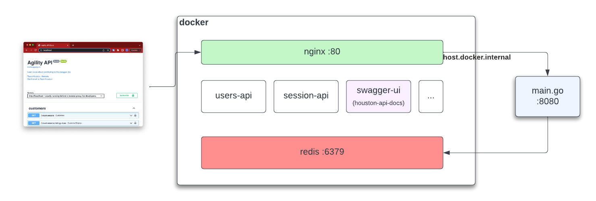

# Barebones Local Reverse Proxy

A [docker-compose.yaml](docker-compose.yaml) with a reverse proxy. Requires Docker
and access to the repo where your containers are stored. We're using hardcoded
tags, as we have no `latest` or `develop` image tags to reference. The tags
are the short-hash of the commits they were built from in github.

Use this sort of thing when you need to run a bunch of services behind a host:port. This one uses nginx.



## Requirements

- Docker
- Google Container Registry access
- gcloud cli

## Usage

Log in to GCR so you can pull images. You may need to [install gcloud cli](https://cloud.google.com/sdk/docs/install).

```sh
gcloud init
gcloud auth login
gcloud auth configure-docker
```

Launch the services.

```sh
docker-compose up --abort-on-container-exit
```

The proxy will listen on [localhost](http://localhost) and expose the swagger-ui for [houston-api-docs](https://github.com/dmsi-io/houston-api-docs).

## Using a Local Container for a Service

You may want to route back to your host machine for a particular endpoint. For example,
if I'm running the `widges-api` service in my IDE on port 8080, then modify [default.conf](conf.d/default.conf) accordigly.

```nginx
location /widgets-api {
    # proxy_pass http://widgets-api:8080/widgets;
    proxy_pass http://host.docker.internal:8080/widgets;
}
```

## Using Local Swagger UI

To use a local swagger UI instead of a pre-built one, launch swagger-ui locally (localhost:3000) and change the all the `houston-api-docs` entries to point to `host.docker.internal:3000` instead, e.g.

```nginx
location /node_modules {
    # proxy_pass http://houston-api-docs:80;
    proxy_pass http://host.docker.internal:3000;
}
```

## Redis

Redis will be exposed to the host machine on port 6379. You can point to it in apps by setting the environment variable `REDIS_HOST=localhost`.

## Related Links

- [gcloud authentication](https://cloud.google.com/container-registry/docs/advanced-authentication#gcloud-helper)
- [DMSi GCR](https://console.cloud.google.com/gcr/images/a2w-staging?authuser=0&project=a2w-staging)
- [Houston API Docs](https://houston-api-docs.dmsi.io/)